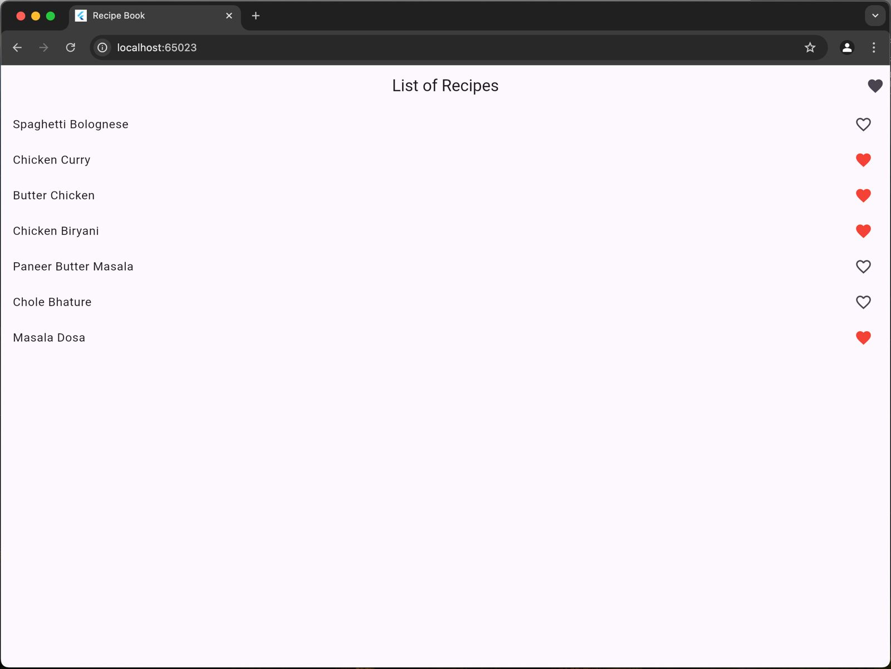
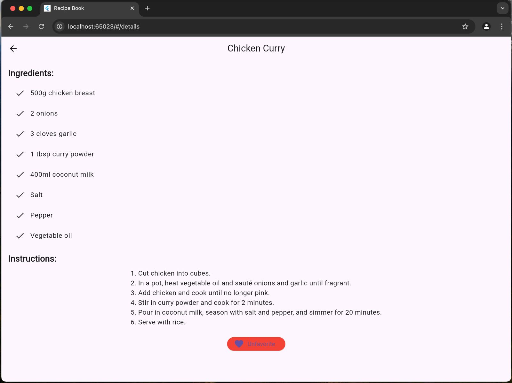
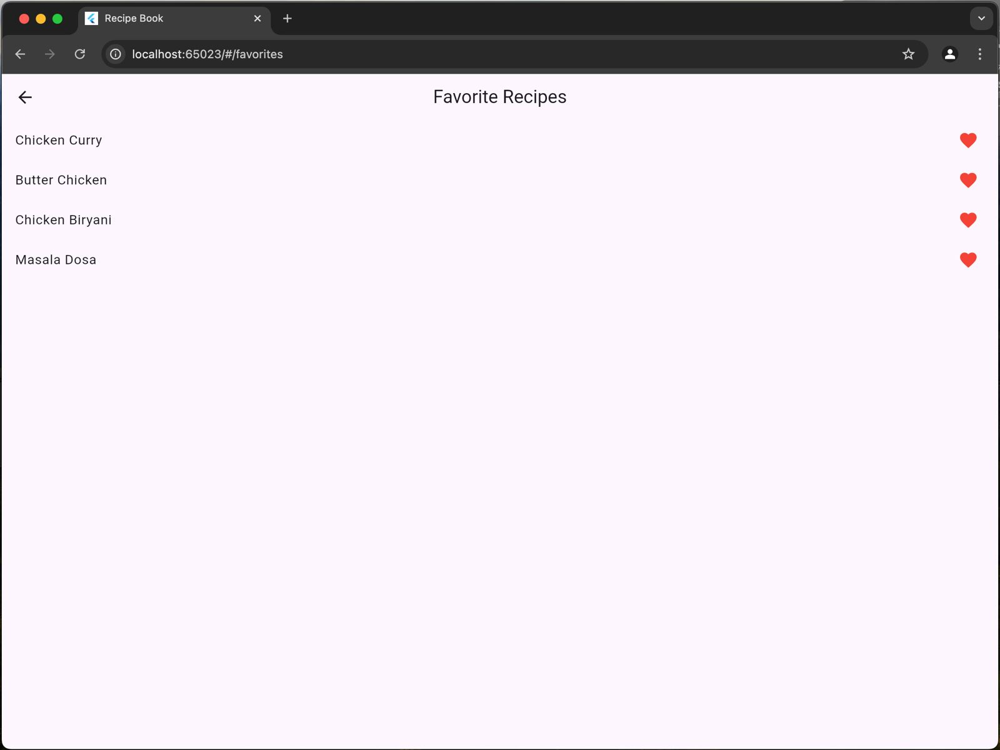

# 🍽️ Recipe Book App

The **Recipe Book App** is a Flutter-based application that allows users to explore a collection of recipes, view detailed instructions and ingredients, and mark their favorite recipes. This app consists of three screens: the `HomeScreen`, `DetailsScreen`, and `FavoritesScreen`, providing an interactive and seamless navigation experience.

## 📱 Features

- **Home Screen:** Displays a list of available recipes.
- **Details Screen:** Shows detailed information about a selected recipe, including ingredients and instructions.
- **Favorite Recipes:** Users can mark/unmark recipes as favorites and view them in a dedicated Favorites screen.
- **Interactive UI:** User-friendly interface with buttons for navigating and toggling favorites.

## 🎯 Requirements

To run this project, ensure you have the following:

- Flutter SDK (version 3.10+)
- Dart SDK (version 2.19+)
- Android Studio, Visual Studio Code, or any IDE supporting Flutter
- Any emulator (iOS, Android, or Chrome for the web)

## 🛠️ Installation and Setup

Follow these steps to set up and run the Recipe Book App on your local machine:

### 1. Clone the Repository

```bash
git clone https://github.com/SamiAhmed007/Recipe_Book.git
cd Recipe_Book
```

### 2. Install Dependencies

Ensure that all required dependencies are installed by running:

```bash
flutter pub get
```

### 3. Run the App

You can run the app on an emulator or a connected device using:

```bash
flutter run
```

The app will start in debug mode. To run it in release mode for better performance, use:

```bash
flutter run --release
```

## 📜 Project Structure

```
.
├── lib
│   ├── main.dart                # Entry point of the app
│   ├── models
│   │   └── recipe.dart           # Recipe model definition
│   ├── providers
│   │   └── recipe_provider.dart  # Recipe state management
│   ├── screens
│   │   ├── home_screen.dart      # HomeScreen UI
│   │   ├── details_screen.dart   # DetailsScreen UI
│   │   └── favorites_screen.dart # FavoritesScreen UI
└── README.md                    # Project documentation
```

### 🗂️ Key Files

- `lib/main.dart`: The starting point of the application.
- `lib/providers/recipe_provider.dart`: Handles state management for recipes, including favorites.
- `lib/screens/home_screen.dart`: Displays a list of recipes.
- `lib/screens/details_screen.dart`: Shows detailed information about the selected recipe.
- `lib/screens/favorites_screen.dart`: Lists recipes marked as favorites.

## 🍴 Adding Recipes

To add new recipes to the app, simply update the `recipe_provider.dart` file by adding more `Recipe` objects. Each recipe requires the following fields:
- `id`: Unique identifier for the recipe.
- `name`: Name of the recipe.
- `ingredients`: List of ingredients required.
- `instructions`: Detailed steps for preparing the recipe.
- `isFavorite`: Boolean to track if the recipe is marked as a favorite.

## 🎨 Screenshots

### Home Screen



### Details Screen



### Favorites Screen



*Note: Replace the screenshots with actual screenshots of your app.*

## 🧑‍💻 Technologies Used

- **Flutter**: UI toolkit for building natively compiled applications for mobile, web, and desktop from a single codebase.
- **Dart**: Programming language optimized for building apps.

## 🏆 Extra Task (Graduate Feature)

For graduate students, the following feature is added:
- **Favorite Recipes**: Users can mark/unmark recipes as favorites using the "Favorite" button in the `DetailsScreen`. A `FavoritesScreen` allows users to view all their favorite recipes.

## 🧩 Contributing

Contributions are welcome! If you have any ideas to improve the app or want to fix bugs, feel free to submit a pull request.

### Steps to Contribute:

1. Fork the repository
2. Create a new branch (`git checkout -b feature/your-feature-name`)
3. Make your changes and commit (`git commit -m 'Add feature'`)
4. Push to the branch (`git push origin feature/your-feature-name`)
5. Open a pull request

## 🔒 License

This project is licensed under the **MIT License**.

## 💡 Future Improvements

Here are some ideas for future improvements:
- Add categories to recipes (e.g., Vegetarian, Non-Vegetarian, Desserts).
- Implement search functionality.
- Include recipe images to make the UI more engaging.

## 🤝 Acknowledgments

- Thanks to the Flutter team for their excellent framework.
- Inspired by traditional Indian recipes.
  
## 🙋‍♂️ Contact

For any questions, suggestions, or issues, feel free to reach out at samiahmedmhd@gmail.com.

---

Happy coding! 🎉
